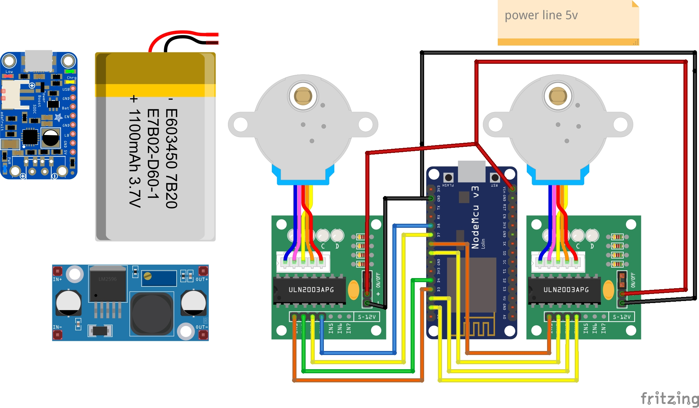
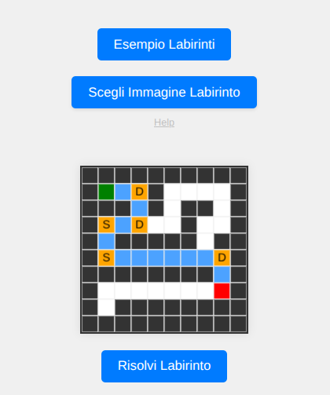
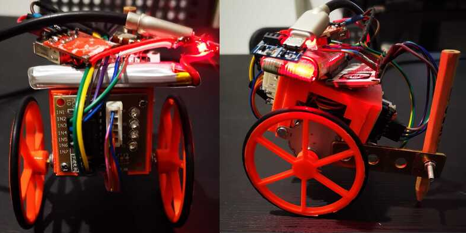
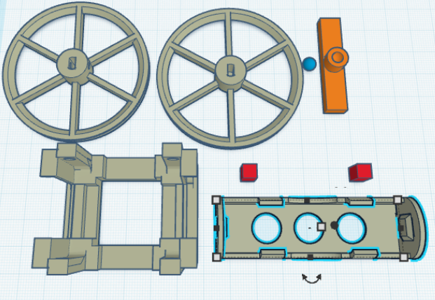

# A* Pathfinding Robot

This project demonstrates an autonomous robot utilizing the A* graph search algorithm for navigation. The robot is built around an ESP8266 microcontroller, controlling a stepper motor with a ULN2003 driver. This example provides a foundational understanding of autonomous obstacle course navigation for vehicles.

## Features

* **A-star Pathfinding:** Implements the A* graph search algorithm for efficient navigation.
* **ESP8266 Control:** Utilizes an ESP8266 for core control and Wi-Fi connectivity.
* **Stepper Motor Drive:** Employs a stepper motor with a ULN2003 driver for precise movement.
* **Web-based Control:** Features an HTTP interface for robot control and maze loading.
* **3D Printable Parts:** Includes 3D printable components for robot construction.

## Sample Images

* **Robot with ESP8266 and ULN2003 Stepper Motor:**


* **HTTP Control Webpage:**



* **Robot Sample:**


* **3D Printer Robot Parts:**


(Find `.stl` files in the `3dparts` folder.)

## Getting Started

### Prerequisites

* Arduino IDE or Arduino CLI
* ESP8266 board definitions for Arduino
* A C++ compiler (for maze conversion tool)

### Hardware Setup

* Connect the ESP8266 to the ULN2003 driver and stepper motor as per the circuit diagram (implied by `SAMPLE_ROBOT_ESP8266_bb.jpg`).

### Software Configuration

1.  **Configure Wi-Fi Credentials:**
    Open the `robot_a_star_pathfinding.ino` file and replace `WIFI_ESSID` and `WIFI_PASSWORD` with your network credentials:

    ```c++
    const char* ssid     = "YOUR_WIFI_ESSID";
    const char* password = "YOUR_WIFI_PASSWORD";
    ```

2.  **Configure Network Settings (Optional - for Static IP):**
    In `robot_a_star_pathfinding.ino`, modify the static IP address, gateway, subnet, and DNS server if needed for your network:

    ```c++
    IPAddress staticIP(199, 168, 1, 132); // Recommended: Choose an IP outside your DHCP range
    IPAddress gateway(199, 168, 1, 1);
    IPAddress subnet(255, 255, 255, 0);
    IPAddress dns(199, 168, 1, 1);
    ```
    *Note: The original IP addresses (192.168.1.x) were changed to 199.168.1.x in the example to highlight that these should be configured to your specific network. Please revert to 192.168.1.x if that's your actual network scheme.*

### Uploading the Sketch

1.  **Upload via USB (Initial Upload):**

    ```bash
    ./arduino-cli compile --verify --upload -p /dev/ttyUSB0 --fqbn esp8266:esp8266:nodemcu Arduino/robot_a_star_pathfinding/robot_a_star_pathfinding.ino -v
    ```

2.  **Upload Over-The-Air (OTA) (After initial upload):**

    ```bash
    ./arduino-cli compile --verify --upload --protocol network --port 199.168.1.132 --fqbn esp8266:esp8266:nodemcu Arduino/robot_a_star_pathfinding/robot_a_star_pathfinding.ino -v
    ```
    *Note: Replace `199.168.1.132` with the actual IP address of your ESP8266.*

### Creating a 2D Array Maze

1.  **Navigate to the `convert_img_to_maze` directory:**

    ```bash
    cd convert_img_to_maze
    ```

2.  **Compile the maze conversion tool:**

    ```bash
    make
    ```

3.  **Convert an image to a maze text file:**

    ```bash
    ./create_map ../mappe/10x10map.png > ../mappe/10x10.txt
    ```
    This command converts `10x10map.png` into a 2D array representation in `10x10.txt`.

### Loading the Maze

* After uploading the sketch and configuring your network, open a web browser and navigate to the robot's IP address (e.g., `http://199.168.1.132/`). You can then load the generated `10x10.txt` maze file via the webpage interface.
